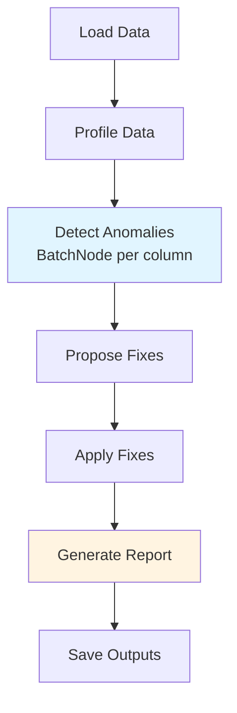

# Design Doc: Data Cleaning & Health Report System

> Please DON'T remove notes for AI

## Requirements

### Problem Statement

Data scientists and analysts often receive messy CSV datasets with missing values, anomalies, and inconsistencies. Manually cleaning these datasets is time-consuming and error-prone. We need an automated system that:

1. **Profiles** the dataset to understand its structure and quality
2. **Detects anomalies** such as outliers, invalid values, and inconsistencies
3. **Proposes fixes** for missing values and anomalies using intelligent imputation
4. **Generates a report** summarizing the data health and cleaning actions taken

### User Story

**As a** data analyst  
**I want** to upload a messy CSV dataset  
**So that** I can receive a cleaned version with a detailed health report explaining what issues were found and how they were fixed

### Input
- CSV file with ~100 rows and 5 columns
- Mix of numeric and categorical columns
- 2-5% injected noise (missing values, outliers, typos)

### Output
1. **Cleaned CSV file** with imputed values and corrected anomalies
2. **Data Health Report** (YAML format) containing:
   - Data profile summary
   - List of detected anomalies
   - Applied fixes with justifications
   - Overall data quality score

---

## Flow Design

> Notes for AI:
> 1. Consider the design patterns of agent, map-reduce, rag, and workflow. Apply them if they fit.
> 2. Present a concise, high-level description of the workflow.

### Applicable Design Pattern

**Workflow Pattern**: This is a sequential pipeline where each stage builds on the previous:
1. **Profile** → Understand data structure and statistics
2. **Detect** → Identify anomalies using profiling context
3. **Propose** → Generate fix strategies using detection results
4. **Clean** → Apply fixes to create cleaned dataset
5. **Report** → Summarize all findings and actions

**Structured Output**: Each LLM node returns structured YAML for validation and downstream processing.

### Flow High-Level Design

1. **LoadDataNode**: Load the CSV file into memory and perform basic parsing
2. **ProfileDataNode**: Analyze each column's type, statistics, missing value count, and distribution
3. **DetectAnomaliesNode**: Use BatchNode to check each column for outliers, invalid values, and inconsistencies
4. **ProposeFixesNode**: For each anomaly, propose an intelligent fix strategy (mean/median imputation, mode for categorical, pattern-based correction)
5. **ApplyFixesNode**: Apply the proposed fixes to generate a cleaned dataset
6. **GenerateReportNode**: Create a comprehensive YAML report with data health metrics
7. **SaveOutputsNode**: Write the cleaned CSV and health report to disk



---

## Utility Functions

> Notes for AI:
> 1. Understand the utility function definition thoroughly by reviewing the doc.
> 2. Include only the necessary utility functions, based on nodes in the flow.

1. **Call LLM** (`utils/call_llm.py`)
   - *Input*: prompt (str)
   - *Output*: response (str)
   - *Necessity*: Used by ProfileData, DetectAnomalies, ProposeFixes, and GenerateReport nodes for intelligent analysis

2. **Parse Structured Output** (`utils/parse_yaml.py`)
   - *Input*: LLM response (str)
   - *Output*: Parsed dict
   - *Necessity*: Extract and validate YAML from LLM responses to ensure structured data flow

3. **Load CSV** (`utils/load_csv.py`)
   - *Input*: file path (str)
   - *Output*: pandas DataFrame
   - *Necessity*: Read CSV file into memory for processing

4. **Save CSV** (`utils/save_csv.py`)
   - *Input*: DataFrame, file path (str)
   - *Output*: None (writes to disk)
   - *Necessity*: Write cleaned data to output file

5. **Generate Synthetic Data** (`utils/generate_data.py`)
   - *Input*: rows (int), noise_percent (float)
   - *Output*: pandas DataFrame
   - *Necessity*: Create test datasets with controlled noise for development and testing

---

## Data Design

### Shared Store

The shared store structure is organized as follows:

```python
shared = {
    # Original data
    "input_file": "data/messy_data.csv",
    "df_original": pd.DataFrame,  # Original dataframe
    
    # Profiling results
    "profile": {
        "total_rows": 100,
        "total_columns": 5,
        "columns": {
            "age": {
                "type": "numeric",
                "dtype": "int64",
                "missing_count": 3,
                "missing_percent": 3.0,
                "stats": {"mean": 35.2, "median": 34, "std": 12.5, "min": 18, "max": 75},
                "outliers_threshold": {"lower": 5, "upper": 65}
            },
            "name": {
                "type": "categorical",
                "dtype": "object",
                "missing_count": 2,
                "missing_percent": 2.0,
                "unique_count": 95,
                "most_common": "John"
            },
            # ... other columns
        }
    },
    
    # Anomaly detection results
    "anomalies": [
        {
            "row_idx": 15,
            "column": "age",
            "issue_type": "outlier",
            "current_value": 150,
            "severity": "high",
            "description": "Value significantly exceeds expected range"
        },
        {
            "row_idx": 23,
            "column": "age",
            "issue_type": "missing",
            "current_value": None,
            "severity": "medium",
            "description": "Missing value"
        },
        {
            "row_idx": 45,
            "column": "category",
            "issue_type": "invalid",
            "current_value": "Cateogry_A",  # typo
            "severity": "low",
            "description": "Possible typo or invalid category"
        }
        # ... more anomalies
    ],
    
    # Proposed fixes
    "fixes": [
        {
            "row_idx": 15,
            "column": "age",
            "issue_type": "outlier",
            "current_value": 150,
            "proposed_value": 34,  # median
            "strategy": "replace_with_median",
            "justification": "Value 150 is biologically implausible for age; replaced with median"
        },
        {
            "row_idx": 23,
            "column": "age",
            "issue_type": "missing",
            "current_value": None,
            "proposed_value": 35.2,  # mean
            "strategy": "impute_with_mean",
            "justification": "Missing value imputed using column mean"
        },
        {
            "row_idx": 45,
            "column": "category",
            "issue_type": "invalid",
            "current_value": "Cateogry_A",
            "proposed_value": "Category_A",
            "strategy": "pattern_match_correction",
            "justification": "Corrected typo based on valid category values"
        }
        # ... more fixes
    ],
    
    # Cleaned data
    "df_cleaned": pd.DataFrame,
    
    # Final report
    "health_report": {
        "dataset_info": {
            "total_rows": 100,
            "total_columns": 5,
            "original_quality_score": 95.0  # percentage of clean cells
        },
        "issues_found": {
            "total_anomalies": 8,
            "by_severity": {"high": 2, "medium": 4, "low": 2},
            "by_type": {"outlier": 2, "missing": 4, "invalid": 2}
        },
        "fixes_applied": 8,
        "final_quality_score": 100.0,
        "column_reports": [...]  # detailed per-column analysis
    },
    
    # Output paths
    "output_csv": "data/cleaned_data.csv",
    "output_report": "data/health_report.yaml"
}
```

---

## Node Design

### Shared Store

See above for the complete shared store structure.

### Node Steps

> Notes for AI: Carefully decide whether to use Batch/Async Node/Flow.

#### 1. LoadDataNode
- *Purpose*: Load the CSV file into a pandas DataFrame and store in shared
- *Type*: Regular Node
- *Steps*:
  - *prep*: Read `input_file` path from shared store
  - *exec*: Call `load_csv()` utility function (no LLM needed)
  - *post*: Store DataFrame in `shared["df_original"]`, return "default"

#### 2. ProfileDataNode
- *Purpose*: Analyze dataset structure, column types, statistics, and missing values
- *Type*: Regular Node (with LLM)
- *Steps*:
  - *prep*: Read `df_original` from shared, convert first 10 rows + stats to string representation
  - *exec*: Call LLM with prompt to analyze data structure and generate profile in YAML format
  - *post*: Parse YAML response and store in `shared["profile"]`, return "default"

#### 3. DetectAnomaliesNode
- *Purpose*: Identify anomalies in each column (outliers, missing values, invalid categories)
- *Type*: **BatchNode** - process each column independently
- *Steps*:
  - *prep*: Read `df_original` and `profile` from shared; return list of (column_name, column_data, column_profile) tuples
  - *exec*: For each column, call LLM to detect anomalies using column profile context. Return structured YAML with anomalies list
  - *post*: Aggregate all column anomalies into flat list, store in `shared["anomalies"]`, return "default"

#### 4. ProposeFixesNode
- *Purpose*: For each detected anomaly, propose an intelligent fix strategy
- *Type*: Regular Node (with LLM)
- *Steps*:
  - *prep*: Read `profile` and `anomalies` from shared; create context string
  - *exec*: Call LLM with all anomalies and column statistics to propose fixes in YAML format
  - *post*: Parse YAML and store fix proposals in `shared["fixes"]`, return "default"

#### 5. ApplyFixesNode
- *Purpose*: Apply the proposed fixes to create a cleaned DataFrame
- *Type*: Regular Node (no LLM needed)
- *Steps*:
  - *prep*: Read `df_original` and `fixes` from shared
  - *exec*: Iterate through fixes and apply each transformation to create df_cleaned (pure Python/pandas logic)
  - *post*: Store cleaned DataFrame in `shared["df_cleaned"]`, return "default"

#### 6. GenerateReportNode
- *Purpose*: Create comprehensive data health report with quality metrics
- *Type*: Regular Node (with LLM)
- *Steps*:
  - *prep*: Read `profile`, `anomalies`, `fixes` from shared; create summary context
  - *exec*: Call LLM to generate human-readable health report in YAML format with quality scores
  - *post*: Parse and store report in `shared["health_report"]`, return "default"

#### 7. SaveOutputsNode
- *Purpose*: Write cleaned CSV and health report to disk
- *Type*: Regular Node (no LLM needed)
- *Steps*:
  - *prep*: Read `df_cleaned`, `health_report`, `output_csv`, `output_report` paths from shared
  - *exec*: Call utility functions to save CSV and write YAML report to files
  - *post*: Log completion message, return "default"

---

## Notes for Implementation

1. **Validation**: Use `assert` statements in `exec()` to validate YAML structure. Let Node retry mechanism handle failures.

2. **BatchNode Usage**: Only DetectAnomaliesNode uses BatchNode since it processes columns independently. Other nodes work on aggregate data.

3. **Error Handling**: Rely on Node's built-in retry mechanism (set `max_retries=3` for LLM nodes). No try-except in utility functions called from `exec()`.

4. **Structured Output**: All LLM responses should use YAML format wrapped in code fences for reliable parsing.

5. **Iterative Refinement**: Start with simple prompts and refine based on results. The workflow may need adjustment after initial testing.

